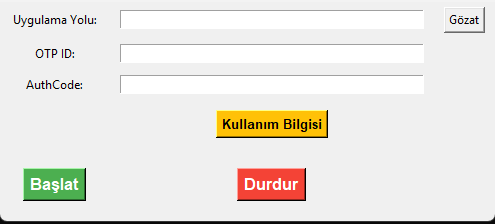

# 🔐 AnyOTP Otomasyon Aracı

AnyOTP uygulaması için otomatik kimlik doğrulama (OTP ID & Auth Code) girişi yapan masaüstü otomasyon aracı.


---

## 📚 Proje Hakkında

Bu uygulama, **AnyOTP** programı için otomatik giriş yaparak şifre ekranı açılana kadar işlemleri otomatikleştirir.  
Herhangi bir kullanıcı müdahalesi olmadan `OTP ID` ve `Auth Code` bilgilerini girebilir ve programı tetikler.

- Eğer AnyOTP çalışmıyorsa, belirtilen yoldan uygulamayı başlatır.
- Eğer zaten çalışıyorsa, mevcut pencereye bağlanır.
- Pywinauto, ctypes, psutil gibi modüller ile pencere ve işlem yönetimi yapar.
- Tkinter arayüzü ile kolay bir kullanım sağlar.

---

## 🚀 Özellikler

- ✅ AnyOTP uygulamasına otomatik giriş yapar
- ✅ Çalışmayan uygulamayı otomatik açar
- ✅ Tkinter GUI ile kolay kullanım
- ✅ PostMessage ile güvenilir tıklama
- ✅ Başlat / Durdur kontrolleri
- ✅ Kullanım bilgisi penceresi

---

## 🛠️ Kurulum

İlk olarak bu repoyu klonlayın:

```bash
git clone https://github.com/KULLANICI_ADIN/anyotp-automation.git
cd anyotp-automation
```

Gereken Python paketlerini yükleyin:

```bash
pip install pywinauto psutil pywin32
```

> **Not:** `tkinter` modülü Python ile birlikte gelir, ayrıca yüklemenize gerek yoktur.

---

## ⚡ Kullanım

1. Uygulamayı çalıştırın:

```bash
python anyotp_automation.py
```

2. **Gözat** butonuna tıklayarak AnyOTP.exe yolunu seçin.
3. `OTP ID` ve `Auth Code` bilgilerinizi girin.
4. **Başlat** butonuna basın.
5. Program şifre ekranını görene kadar otomatik olarak giriş denemeleri yapacaktır.
6. Şifre ekranı açıldığında **Durdur** butonuna basarak işlemi sonlandırabilirsiniz.

> 📢 **Kullanım Bilgisi** butonuna tıklayarak detaylı açıklamalara da ulaşabilirsiniz.

---

## 📷 Ekran Görüntüsü



> Uygulamanın çalışır halini gösteren ekran görüntüsü.

---

## 📦 Gereksinimler

- Python 3.8+
- pywinauto
- psutil
- pywin32
- tkinter

---

## 📌 Bilgilendirme

- Program yalnızca **Windows** işletim sisteminde çalışır.
- **Admin (Yönetici) Modu** ile çalıştırmak gerekebilir, aksi halde pencere erişimi sağlanamayabilir.
- AnyOTP uygulamasının penceresi `AnyOTP` başlığına sahip olmalıdır.

---

## 📝 Lisans

Bu proje [MIT License](LICENSE) ile lisanslanmıştır.

---


